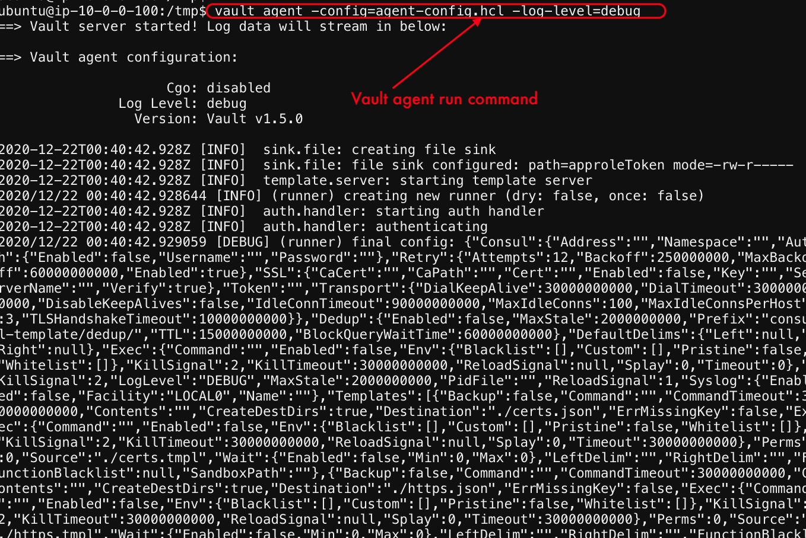
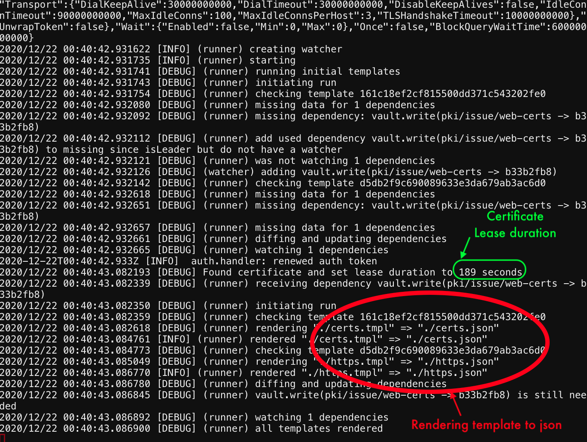

# Run terraform apply again


1. Open the Web Shell if not open  and login to udf/udf

2. Change the directory ```cd f5-terraform-consul-sd-webinar/terraform```

3. Run ```terraform apply -auto-approve```

   
   

4. - [Exercise 4.0 Next follow instruction by clicking here](https://learn.hashicorp.com/tutorials/consul/consul-terraform-sync-f5-bigip-fast?in=consul/network-infrastructure-automation) 


[GoTo Next Exercise-5](5-ex)

[GoBack](../README.md)
