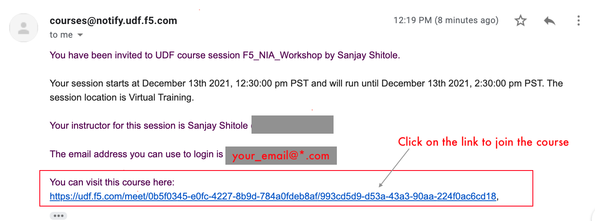

# How to Access Join the Course

1. From your email you have received click on the link

 

2. Click on the Start button Once started click Details
3. Click on Components TAB & then click on Ubuntu --> Access --> WEB SHELL
4. At the prompt enter ``` login udf ``` & Password ``` udf ```

 

5. After logging in udf change directory ```cd f5-certificate-rotate```

[GoTo Next Exercise-2](2-ex)

[GoBack](../README.md)
