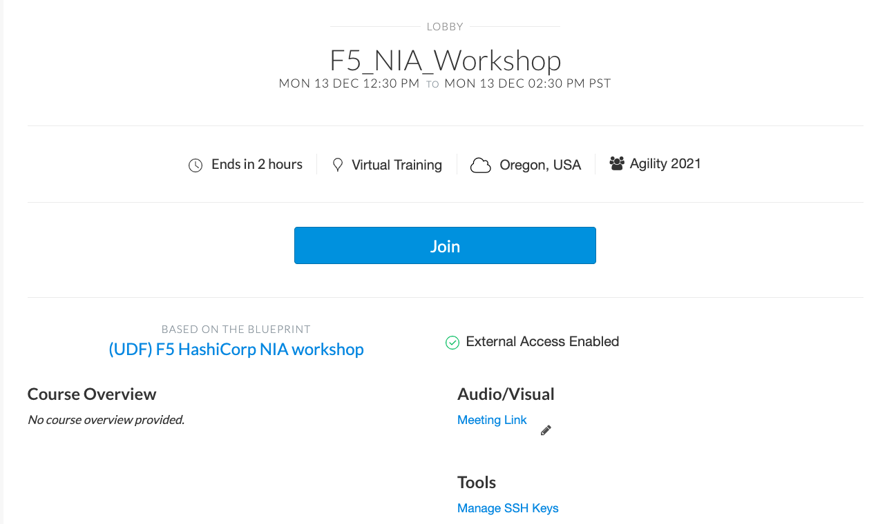

# How to Join the Course

1. From your email you have received click on the link

 

2. You eill get a screen as shown below, click on JOIN

 

3. Click on Deployment as shown in Red.

 

3. Click on Components TAB & then click on Ubuntu --> Access --> WEB SHELL
4. At the prompt enter ``` login udf ``` & Password ``` udf ```

 

5. After logging in udf change directory ```cd f5-certificate-rotate```

[GoTo Next Exercise-2](2-ex)

[GoBack](../README.md)
